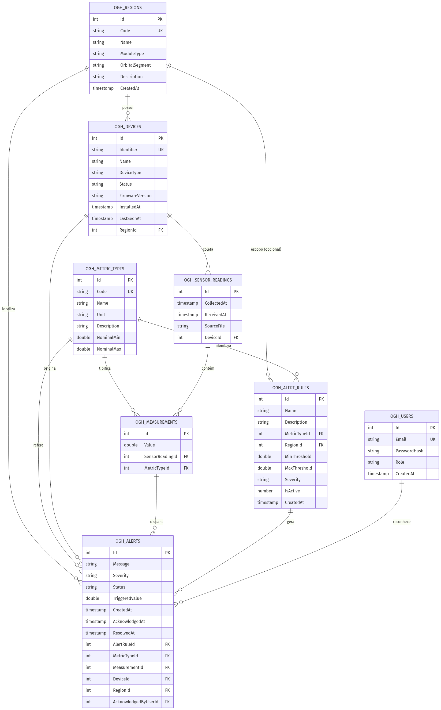

# Orbital Greenhouse API

API RESTful em **ASP.NET Core 9 (C#)** para **monitoramento ambiental e gestão de
alertas** na **produção de alimentos no espaço**. Dispositivos/sensores de campo
coletam métricas ambientais (umidade, luminosidade, oxigênio, gás carbônico, etc.),
transmitem essas leituras como **arquivos JSON**, e o servidor avalia regras de
alerta configuráveis para identificar a **salubridade** de cada região de cultivo
e gerar relatórios.

> Projeto desenvolvido como entrega de **Modelo de Banco de Dados** + **Implementação
> de Serviços (API)**, usando **Oracle** como banco relacional.

---

## Sobre o domínio

Uma estufa orbital é dividida em **regiões** (baias/módulos de cultivo). Cada região
contém **dispositivos** (sensores) que periodicamente enviam **leituras**, e cada
leitura agrupa várias **medições** de **tipos de métrica** do catálogo. **Regras de
alerta** definem limiares (mínimo/máximo) por métrica — globais ou por região —, e
quando uma medição viola um limiar, um **alerta** é gerado automaticamente com a
severidade configurada. Operadores autenticados (via **JWT**) consultam, reconhecem
e resolvem os alertas.

---

## Arquitetura em camadas

```
Controller  ->  Service  ->  Repository  ->  DbContext (EF Core / Oracle)
   (HTTP)       (regras)     (acesso a dados)     (persistência)
```

- **Controllers** — expõem os endpoints REST e fazem binding/validação de DTOs.
- **Services** — concentram as regras de negócio (ingestão, avaliação de alertas, relatórios, auth).
- **Repositories** — abstraem o acesso a dados (genérico `IRepository<T>` + repositórios específicos).
- **DbContext** — mapeamento EF Core para Oracle, com nomes de objetos curtos e portáveis.

```
OrbitalGreenhouse/
├── OrbitalGreenhouse.sln
├── OrbitalGreenhouse.Api/
│   ├── Controllers/        # Regions, Devices, MetricTypes, AlertRules, Alerts, Ingestion, Readings, Reports, Auth, Health, Root
│   ├── Services/           # *Service.cs + Mappers
│   ├── Repositories/       # IRepository<T> + repositórios específicos
│   ├── Data/               # ApplicationDbContext + DesignTimeDbContextFactory
│   ├── Models/             # Entidades + Enums
│   ├── Dtos/               # DTOs de entrada/saída
│   ├── Exceptions/         # Exceções de domínio + GlobalExceptionHandler
│   ├── Migrations/         # Migrations EF Core (Oracle)
│   ├── SampleData/         # Arquivos JSON de sensores para simulação
│   ├── Dockerfile          # Imagem da API (.NET 9)
│   └── appsettings.json
├── db/                     # Scripts SQL (DDL, seed, consultas) + script EF idempotente
├── docs/                   # Diagrama ER (PNG/Mermaid), Postman, er-diagram.mmd
├── scripts/                # test-api-endpoints.ps1 (smoke tests)
├── docker-compose.yml
├── .env.example
└── .github/workflows/      # Publicação da imagem no GHCR
```

Repositório: [github.com/gui2604/ORBITALGREENHOUSE](https://github.com/gui2604/ORBITALGREENHOUSE)

---

## Modelo de dados

8 entidades / tabelas (prefixo `OGH_`):

| Tabela | Descrição |
|--------|-----------|
| `OGH_REGIONS` | Regiões/módulos de cultivo |
| `OGH_METRIC_TYPES` | Catálogo de métricas ambientais (unidade + faixa nominal) |
| `OGH_DEVICES` | Sensores de campo vinculados a uma região |
| `OGH_SENSOR_READINGS` | Evento de coleta (1 arquivo JSON) |
| `OGH_MEASUREMENTS` | Cada valor de métrica de uma leitura |
| `OGH_ALERT_RULES` | Limiares configuráveis (min/max) por métrica/região |
| `OGH_ALERTS` | Alertas gerados (automáticos ou manuais) com ciclo de vida |
| `OGH_USERS` | Operadores autenticados via JWT |

### Diagrama entidade-relacionamento



| Artefato | Descrição |
|----------|-----------|
| [`docs/ER_DIAGRAM.png`](docs/ER_DIAGRAM.png) | Imagem PNG do diagrama (entrega / documentação) |
| [`docs/ER_DIAGRAM.md`](docs/ER_DIAGRAM.md) | Versão Mermaid + cardinalidade e regras de integridade |
| [`docs/er-diagram.mmd`](docs/er-diagram.mmd) | Fonte Mermaid para regerar o PNG |

**Relacionamentos principais:** região → dispositivos → leituras → medições; regras de alerta e alertas ligados a métricas, regiões e dispositivos; usuários reconhecem alertas.

---

## Tecnologias

- .NET 9 / ASP.NET Core Web API
- Entity Framework Core 9 + **Oracle** (`Oracle.EntityFrameworkCore`)
- Autenticação **JWT** (`Microsoft.AspNetCore.Authentication.JwtBearer`)
- **Swagger / OpenAPI** (Swashbuckle)
- **Docker** + **GitHub Container Registry** (`ghcr.io/gui2604/orbitalgreenhouse-api`)
- Arquitetura em camadas (Controller / Service / Repository)

### Compatibilidade Oracle (EF Core)

A API foi ajustada para o Oracle FIAP (tipos `NUMBER(1)` em vez de `BOOLEAN`, SQL sem literal `FALSE`):

- `ExistsAsync` usa `CountAsync` em vez de `AnyAsync` (evita `ORA-00904`).
- Regras de alerta ativas: filtro `IsActive` em memória após a query SQL.
- Campos `bool` mapeados com `HasConversion<int>()` onde necessário.

---

## Configuração do banco Oracle

Servidor FIAP: `oracle.fiap.com.br`, SID/service `ORCL`, usuário `RM97674` (alias TNS **Oracle_FIAP** no SQL Developer).

1. Copie o exemplo local (não versionado):

   ```bash
   copy OrbitalGreenhouse.Api\appsettings.Development.local.example.json OrbitalGreenhouse.Api\appsettings.Development.local.json
   ```

2. Edite `appsettings.Development.local.json` e informe sua senha:

```json
"ConnectionStrings": {
  "OracleDb": "User Id=RM97674;Password=SUA_SENHA;Data Source=oracle.fiap.com.br:1521/ORCL"
}
```

> Formato do `Data Source`: `HOST:PORTA/SERVICE_NAME` (equivalente ao TNS `Oracle_FIAP`).
> O arquivo `*.local.json` está no `.gitignore` — **não commite a senha**.
> Em produção, use `ConnectionStrings__OracleDb` como variável de ambiente.

---

## Docker

A API pode rodar em container (Oracle FIAP continua **externo** — o container só precisa de rede até `oracle.fiap.com.br`).

```bash
# 1. Criar .env a partir do exemplo e informar ORACLE_PASSWORD
copy .env.example .env

# 2. Subir a API (build + run)
docker compose up --build -d

# 3. Swagger
#    http://localhost:8080/swagger
```

Imagem publicada no **GitHub Container Registry**:

```bash
docker pull ghcr.io/gui2604/orbitalgreenhouse-api:latest
docker run -p 8080:8080 \
  -e ASPNETCORE_ENVIRONMENT=Development \
  -e ORACLE_PASSWORD=SUA_SENHA \
  -e ConnectionStrings__OracleDb="User Id=RM97674;Password=${ORACLE_PASSWORD};Data Source=oracle.fiap.com.br:1521/ORCL" \
  ghcr.io/gui2604/orbitalgreenhouse-api:latest
```

> Após o primeiro `docker push`, torne o pacote **público** em GitHub → seu perfil → **Packages** → `orbitalgreenhouse-api` → Package settings → Change visibility.

Comandos úteis:

```bash
docker compose logs -f api
docker compose down
```

Em **Development**, a API aplica **migrations do EF na inicialização** (`Database.Migrate()`), criando tabelas e o seed das 8 métricas do catálogo — tanto no `dotnet run` quanto no container.

| Ambiente | URL base | Swagger |
|----------|----------|---------|
| Docker (`docker compose`) | `http://localhost:8080` | `/swagger` |
| `dotnet run` (perfil https) | `https://localhost:7118` | `/swagger` |
| `dotnet run` (perfil http) | `http://localhost:5268` | `/swagger` |

---

## Como executar (local)

```bash
# 1. Configurar senha Oracle (ver seção acima)
copy OrbitalGreenhouse.Api\appsettings.Development.local.example.json OrbitalGreenhouse.Api\appsettings.Development.local.json

# 2. Restaurar pacotes
dotnet restore

# 3. (Opcional) aplicar schema manualmente — em Development a API já migra ao subir
dotnet ef database update --project OrbitalGreenhouse.Api

# 4. Rodar a API
dotnet run --project OrbitalGreenhouse.Api

# 5. Swagger
#    https://localhost:7118/swagger
```

Alternativa sem EF: aplicar manualmente os scripts em [`db/`](db/) no Oracle SQL Developer.

---

## Credenciais de teste (Swagger / Postman)

A API **não** vem com senha no `appsettings` — o JWT é obtido via **login** ou **register**.
Em **Development** (Docker ou `dotnet run`), um operador de demonstração é criado automaticamente na subida do servidor.

### Conta padrão para validação

| Campo | Valor |
|-------|--------|
| **E-mail** | `operador@orbital.space` |
| **Senha** | `orbital123` |
| **Papel** | `Operator` |

Use no Swagger: **Auth → POST /api/v1/auth/login** com o JSON:

```json
{
  "email": "operador@orbital.space",
  "password": "orbital123"
}
```

A resposta **200** traz o campo `"token"` para colar em **Authorize** (ver seção Swagger abaixo).

> **Por que aparece `"Credenciais inválidas."` (400)?**  
> O login só funciona se esse e-mail **já existir** em `OGH_USERS`. Isso ocorre após o seed automático (Development) ou depois de um **register** bem-sucedido.  
> Se você tentou `operador@fiap.test` / `MinhaSenha123!` **sem** registrar antes, o login falha — ou use a conta padrão acima, ou faça **register** e depois **login** com o **mesmo** e-mail e senha.

### Criar outro usuário (opcional)

**POST /api/v1/auth/register** — mínimo 6 caracteres na senha:

```json
{
  "email": "seu.email@fiap.test",
  "password": "SuaSenha123!",
  "role": "Operator"
}
```

Depois use **login** com exatamente o mesmo e-mail e senha (o e-mail é normalizado para minúsculas).

A coleção Postman em [`docs/`](docs/) já usa `operador@orbital.space` / `orbital123`.

---

### Validar a API no Swagger (passo a passo)

O Swagger **não guarda** o JWT no servidor nem em arquivo de configuração. Você obtém o token no **login/registro**, cola no botão **Authorize** e o navegador envia o header `Authorization` nas próximas chamadas.

#### 1. Abrir o Swagger

Use a URL do ambiente em que a API está rodando (veja a tabela acima):

- Docker: [http://localhost:8080/swagger](http://localhost:8080/swagger)
- Local HTTPS: [https://localhost:7118/swagger](https://localhost:7118/swagger)

> Se o browser avisar sobre certificado HTTPS em desenvolvimento, aceite o risco ou use o perfil HTTP (`http://localhost:5268/swagger`).

#### 2. Obter o token JWT

1. Expanda **Auth** → **POST /api/v1/auth/login** (recomendado — conta padrão já existe em Development).
2. Clique em **Try it out**.
3. Use o body abaixo (**credenciais de teste** documentadas acima):

```json
{
  "email": "operador@orbital.space",
  "password": "orbital123"
}
```

4. Clique em **Execute** — espere **200**. Se vier **400** com `"Credenciais inválidas."`, confira e-mail/senha ou reinicie a API (seed do usuário demo) ou faça **register** antes do login.
5. Copie **somente** o valor do campo `"token"` (começa com `eyJ...`).

Exemplo de trecho da resposta:

```json
{
  "token": "eyJhbGciOiJIUzI1NiIsInR5cCI6IkpXVCJ9...",
  "expiresAt": "2026-06-04T20:00:00Z",
  "email": "operador@orbital.space",
  "role": "Operator"
}
```

#### 3. Autorizar no Swagger

1. No topo da página, clique no botão **Authorize** (ícone de cadeado).
2. No campo **Bearer**, cole **apenas** o `token` copiado (sem escrever a palavra `Bearer` — o Swagger adiciona isso automaticamente).
3. Clique em **Authorize** e depois **Close**.

Endpoints protegidos passam a enviar `Authorization: Bearer {seu-token}`. Se aparecer **401 Unauthorized**, o token não foi informado, expirou (válido por ~4 h) ou foi colado incorretamente — repita o login e o **Authorize**.

#### 4. Ordem sugerida para validar o fluxo completo

| Passo | Endpoint (Swagger) | Observação |
|-------|-------------------|------------|
| 1 | `POST /api/v1/auth/login` | Gera o JWT com `operador@orbital.space` / `orbital123` |
| 2 | `GET /api/healthcheck/full` | Confirma API + Oracle (requer JWT) |
| 3 | `POST /api/v1/regions` | Cria uma região de cultivo |
| 4 | `POST /api/v1/devices` | Use `regionId` da região criada |
| 5 | `GET /api/v1/metric-types` | Catálogo já vem do seed (CO2, TEMPERATURE, etc.) |
| 6 | `POST /api/v1/alert-rules` | Ex.: `metricTypeId` do CO2, `maxThreshold` 1200 |
| 7 | `POST /api/v1/ingestion/readings` | JSON com `deviceIdentifier` do dispositivo cadastrado |
| 8 | `GET /api/v1/alerts` | Ver alertas gerados pela ingestão |
| 9 | `GET /api/v1/reports/region-health` | Relatório de salubridade |

Para **upload** de arquivo JSON, use `POST /api/v1/ingestion/upload` (multipart) ou teste pelo Postman (mais simples para arquivo).

#### 5. Endpoints que **não** precisam de Authorize

- `GET /` · `GET /api/healthcheck` (básico)
- `POST /api/v1/auth/register` · `POST /api/v1/auth/login`

Todos os demais recursos listados em **Endpoints → Protegidos** exigem o JWT configurado no passo 3.

---

## Endpoints

### Públicos
| Método | Rota | Descrição |
|--------|------|-----------|
| POST | `/api/v1/auth/register` | Cria operador e retorna JWT |
| POST | `/api/v1/auth/login` | Autentica e retorna JWT |
| GET | `/api/healthcheck` | Liveness básico |
| GET | `/` | Informações da API |

### Protegidos (requer JWT)
| Recurso | Endpoints |
|---------|-----------|
| **Regions** | `GET /api/v1/regions` · `GET /{id}` · `POST` · `PUT /{id}` · `DELETE /{id}` |
| **Devices** | `GET /api/v1/devices` · `GET /{id}` · `GET /by-region/{regionId}` · `POST` · `PUT /{id}` · `DELETE /{id}` |
| **Metric Types** | `GET /api/v1/metric-types` · `GET /{id}` · `POST` · `PUT /{id}` · `DELETE /{id}` |
| **Alert Rules** | `GET /api/v1/alert-rules` · `GET /{id}` · `POST` · `PUT /{id}` · `DELETE /{id}` |
| **Ingestion** | `POST /api/v1/ingestion/readings` · `POST /readings/batch` · `POST /upload` (arquivo JSON) |
| **Alerts** | `GET /api/v1/alerts` (filtros) · `GET /{id}` · `POST` (manual) · `PUT /{id}/status` · `DELETE /{id}` |
| **Readings** | `GET /api/v1/readings/{id}` · `GET /by-device/{deviceId}` |
| **Reports** | `GET /api/v1/reports/region-health` · `/{regionId}` · `/alerts-summary` |
| **Health** | `GET /api/healthcheck/full` (verifica conexão Oracle) |

### Postman

| Arquivo | Uso |
|---------|-----|
| [`docs/OrbitalGreenhouse.postman_collection.json`](docs/OrbitalGreenhouse.postman_collection.json) | Todos os endpoints agrupados por recurso |
| [`docs/OrbitalGreenhouse.postman_environment.json`](docs/OrbitalGreenhouse.postman_environment.json) | Variáveis `baseUrl`, `baseUrlHttps` e `token` |

**Importar:** Postman → **Import** → selecione a collection (e o environment, se quiser).

1. Ajuste `baseUrl` (`http://localhost:8080` no Docker ou `https://localhost:7118` no `dotnet run`).
2. Execute **Auth → Login** (o script de teste salva o JWT em `{{token}}`).
3. Demais requisições usam Bearer `{{token}}` automaticamente.

### Testes automatizados (smoke)

Script PowerShell que percorre **47 cenários** (CRUD, ingestão, alertas, relatórios e casos 4xx):

```powershell
# Com a API no ar (Docker ou dotnet run)
powershell -File .\scripts\test-api-endpoints.ps1

# Outra URL base
powershell -File .\scripts\test-api-endpoints.ps1 -BaseUrl "https://localhost:7118"
```

O script falha se houver resposta **5xx** ou status inesperado. Útil após alterações ou reinício do container.

---

## Simulação de entrada de métricas (arquivos JSON)

Cada sensor envia um JSON. Exemplos em [`OrbitalGreenhouse.Api/SampleData/`](OrbitalGreenhouse.Api/SampleData/):

```json
{
  "deviceIdentifier": "SENSOR-A1-02",
  "collectedAt": "2026-06-04T12:05:00Z",
  "measurements": [
    { "metricCode": "CO2", "value": 1850 },
    { "metricCode": "O2", "value": 17.8 }
  ]
}
```

Ao ingerir, a API: persiste a leitura e as medições, atualiza o `LastSeenAt` do
dispositivo, **avalia as regras de alerta ativas** para a métrica/região e cria os
alertas correspondentes — retornando quantos alertas foram disparados.

---

## Scripts SQL (pasta `db/`)

| Arquivo | Conteúdo |
|---------|----------|
| `01_create_tables.sql` | DDL limpo: `CREATE TABLE`, PKs, FKs e índices |
| `02_seed_data.sql` | Dados de exemplo (métricas, regiões, dispositivos, regras) |
| `03_sample_queries.sql` | Consultas de simulação (inventário, salubridade, relatórios) |
| `99_ef_idempotent_oracle.sql` | Script gerado pelo EF Core (aplicação idempotente) |

---

## Equipe / Disciplina

Projeto acadêmico — entrega de **Modelo de Banco de Dados** e **Implementação dos
Serviços (API)**. Contexto: produção de alimentos no espaço (*Orbital Greenhouse*).
